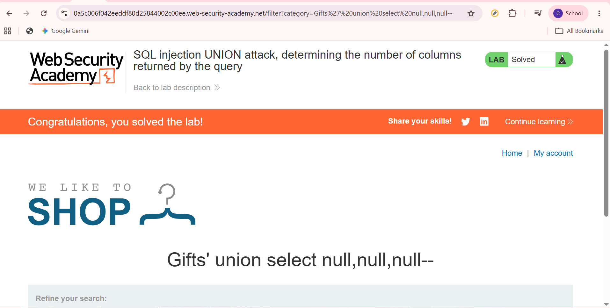

# SQL Injection UNION Attack, Determining the Number of Columns Returned by the Query

## Overview

This lab demonstrates how attackers determine the number of columns returned by an SQL query before performing a UNION-based SQL Injection attack.

---

## Objective

Identify the correct number of columns used in the application's SQL query.

---

## Environment

- Platform: PortSwigger Web Security Academy
- Category: SQL Injection
- Difficulty: Apprentice

---

## Methodology

1. Analyze the vulnerable request.
2. Test SQL Injection behavior.
3. Determine the number of columns accepted by the SQL query.
4. Verify that the query accepts UNION operations.

---

## Result

Successfully determined the correct number of columns required for a UNION-based SQL Injection attack.

---

## Security Impact

If attackers can determine the database structure, they may prepare more advanced SQL Injection attacks to retrieve sensitive information.

---

## Mitigation

- Use parameterized queries.
- Validate user input.
- Disable verbose database error messages.
- Apply the principle of least privilege.

---

## Related OWASP Top 10

- A03:2021 – Injection

---

## Screenshot

---

## Learning Reflection

This lab taught me that understanding the database query structure is an important step before extracting data through UNION-based SQL Injection.
