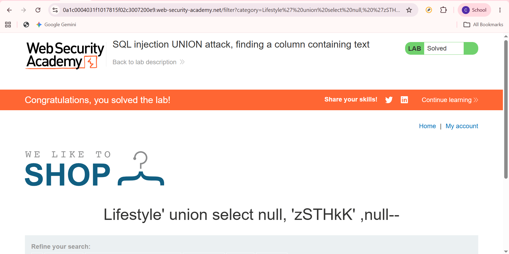

# SQL Injection UNION Attack - Finding a Column Containing Text

## Overview

This lab demonstrates how to identify which column in the SQL query accepts text values. This information is required before retrieving data using a UNION-based SQL Injection attack.

---

## Objective

Determine which column supports text values for a successful UNION-based SQL Injection attack.

---

## Environment

**Platform:** PortSwigger Web Security Academy

**Category:** SQL Injection

**Difficulty:** Apprentice

---

## Methodology

1. Identify the vulnerable parameter.
2. Determine the number of columns returned by the query.
3. Test each column to identify which one accepts text values.
4. Confirm the correct column by observing the application's response.

---

## Result

Successfully identified the column capable of displaying text values, enabling further UNION-based data retrieval.

---

## Security Impact

An attacker who identifies compatible columns can continue exploiting the vulnerability to retrieve sensitive database information.

---

## Mitigation

- Use prepared statements.
- Apply parameterized SQL queries.
- Validate all user input.
- Restrict database permissions.

---

## Related OWASP Top 10

**A03:2021 – Injection**

---

## Screenshot

---

## Learning Reflection

This lab improved my understanding of how UNION-based SQL Injection works and why identifying compatible data types is essential before extracting information from a database.
